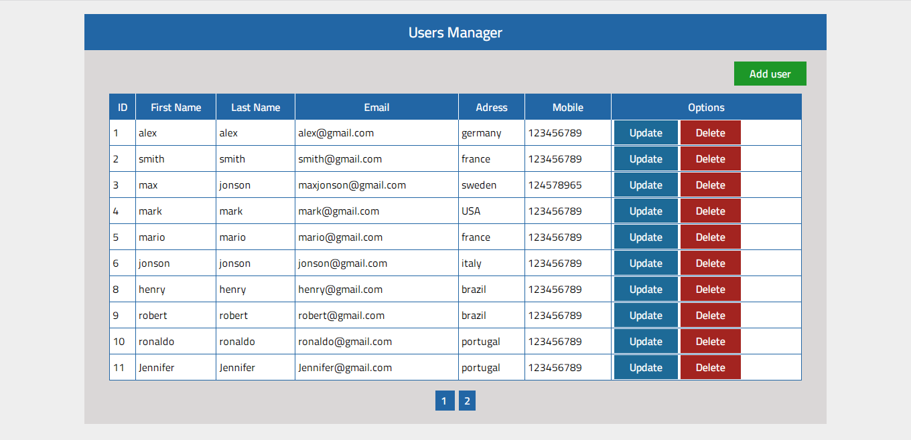

## Simple PHP CRUD Example :

Simple example to add, read, update, delete , display in PHP & MYSQL.

sql script 'database/database.sql' to create database and table for the example .

## Preview :

